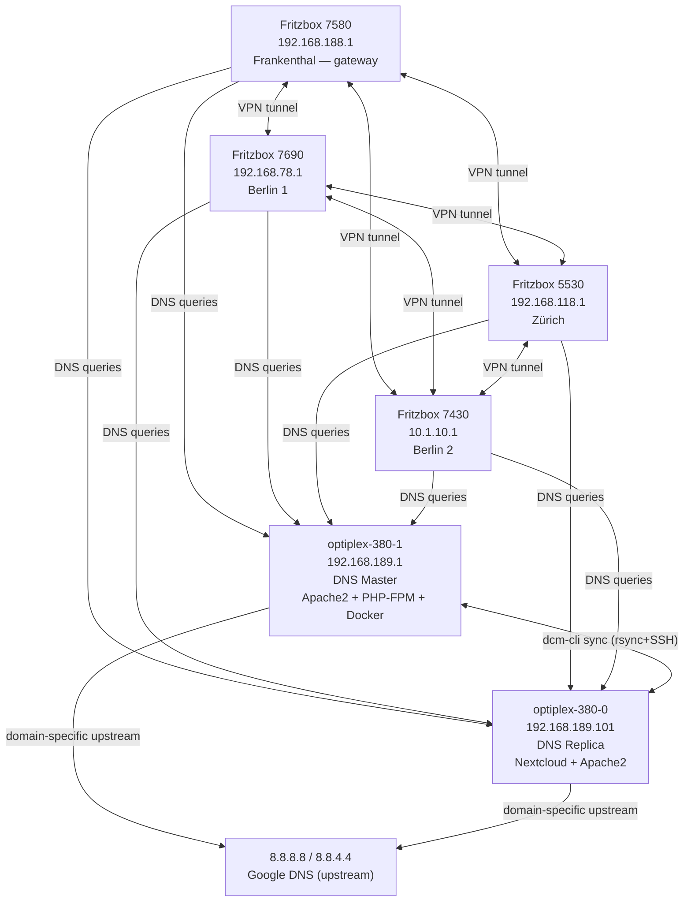
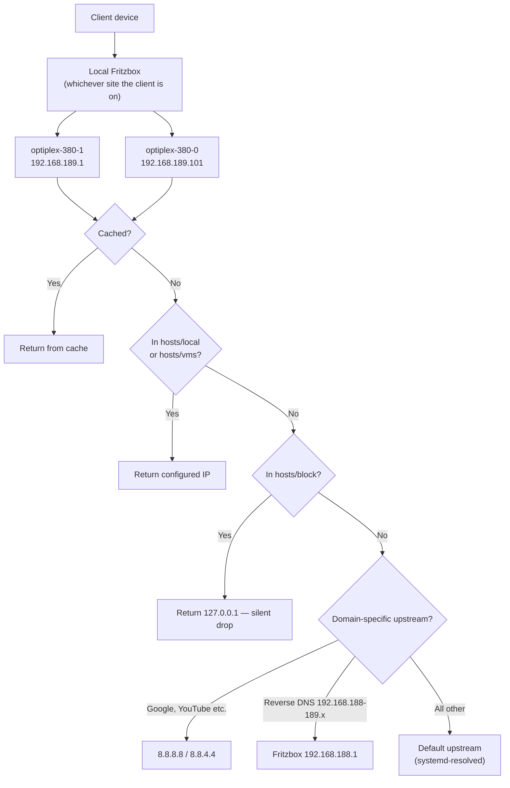
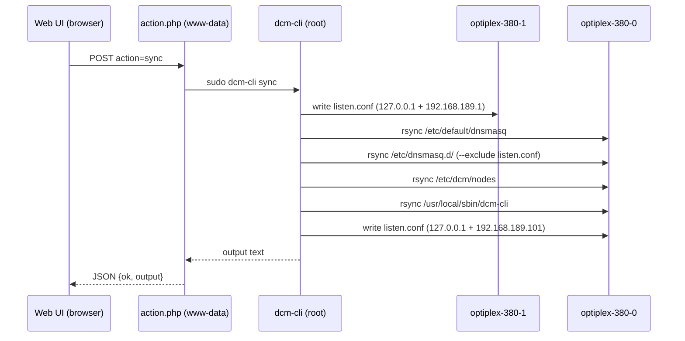
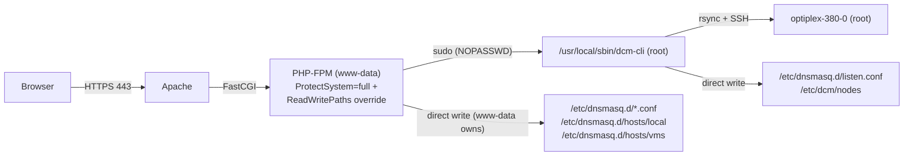
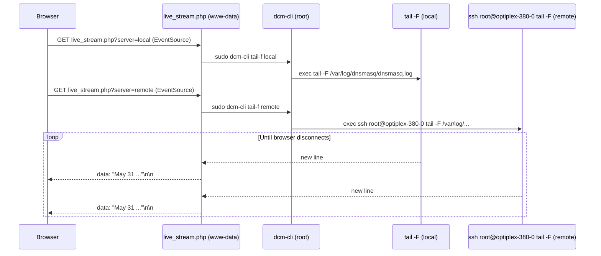
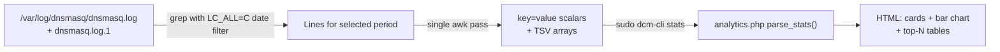

<!--
SPDX-FileCopyrightText: 2026 [ernolf] Raphael Gradenwitz
SPDX-License-Identifier: GPL-3.0-or-later
-->

# dnsmasq cluster manager: Architecture & Setup Reference

This document describes the complete architecture of the `dcm` - dnsmasq cluster management system as deployed in a multi-site home network. It serves as a reference for future development.

---

## 1. Network Overview

Four Fritzbox networks are interconnected via full-mesh VPN tunnels. All four share the same two dnsmasq servers as their primary DNS. Clients get their DNS server address via DHCP from their local Fritzbox, which forwards queries to the dnsmasq cluster.

| Site | Router | Network |
|---|---|---|
| Frankenthal | Fritzbox 7580 | 192.168.188.0/23 |
| Berlin 1 | Fritzbox 7690 | 192.168.78.0/24 |
| Zürich | Fritzbox 5530 Fiber | 192.168.118.0/24 |
| Berlin 2 | Fritzbox 7430 | 10.1.10.0/24 |



The dnsmasq servers live in the home network (`192.168.189.x`), which is a /23 subnet of the home Fritzbox. All four Fritzboxen forward DNS queries to both servers. Clients always query through their local Fritzbox.

---

## 2. dnsmasq Configuration

Both servers run **identical configuration** except for `listen.conf` (server-specific listen address).

### `/etc/default/dnsmasq`
```
ENABLED=1
DNSMASQ_OPTS="--conf-file=/dev/null"
CONFIG_DIR=/etc/dnsmasq.d,.dpkg-dist,.dpkg-old,.dpkg-new
IGNORE_RESOLVCONF=yes
```

### Drop-in configuration

There is no monolithic config file — `--conf-file=/dev/null` makes dnsmasq read **only** the drop-ins in `/etc/dnsmasq.d/`. Each setting is its own `<directive>.conf` (present = active, absent = dnsmasq's default), written by the Configuration page. Key drop-ins:
- `domain-needed.conf` / `bogus-priv.conf` — security
- `resolv-file.conf` — upstream from systemd-resolved (`resolv-file = /run/systemd/resolve/resolv.conf`)
- `addn-hosts.conf` (`addn-hosts = /etc/dnsmasq.d/hosts`) — loads the entire hosts directory
- `log-queries.conf` + `log-facility.conf` — full query logging

### `/etc/dnsmasq.d/` structure

| File | Synced | Purpose |
|---|---|---|
| `<directive>.conf` | Yes | one drop-in per dnsmasq option (Configuration page) |
| `listen.conf` | **No** | `listen-address = 127.0.0.1` + own IP — generated per node |
| `upstream.conf` | Yes | All `server =` directives |
| `hosts/local` | Yes | LAN hosts, swarm nodes, Fritzboxen |
| `hosts/vms` | Yes | VM entries — IPs change per connected network |
| `hosts/block` | Yes | Phone-home domains → 127.0.0.1 (Acronis, Adobe, Piriform) |

### DNS query routing logic



---

## 3. The `dcm-cli` Tool

Location: `/usr/local/sbin/dcm-cli` — present on **both** nodes, synced automatically.

PHP calls it via `sudo` (sudoers: `www-data ALL=(root) NOPASSWD: /usr/local/sbin/dcm-cli *`).

### Key design decisions

- **Single source of truth for listen IP**: reads node IPs from `hosts/local`, never hardcodes them
- **Single source of truth for paths**: reads `CONFIG_DIR` from `/etc/default/dnsmasq`, then `addn-hosts` / `log-facility` from the merged drop-ins
- **Single source of truth for swarm members**: `/etc/dcm/nodes` (hostname list only)
- **`listen.conf` is never synced**: regenerated from `hosts/local` after every sync
- **`LC_ALL=C` for all `date` calls**: dnsmasq logs in English (`May 31`), system locale is German (`Mai 31`)

### Commands

```
sync                           Sync all config files + dcm-cli binary to all remote nodes
restart local|remote|all       systemctl restart dnsmasq
status  local|remote           systemctl status dnsmasq
logs    [N]                    tail -n N of log file
tail-f  local|remote           tail -F — streaming, used by SSE live log endpoint
stats   local|remote [period]  single-pass awk analytics (all|today|1h|24h|7d)
```

### Sync flow



---

## 4. Web Frontend

URL: `https://dns.global-social.net/` (Apache2 on optiplex-380-1, port 443, wildcard TLS cert)
Also: `https://adblock.global-social.net/` (ad-server sink — served by same Apache, returns blocked page)

### Page map

| Page | File | Description |
|---|---|---|
| Dashboard | `dashboard.php` | Server status (incl. listen addresses + port), Sync/Restart controls with live output |
| Hosts | `hosts.php` | Edit `hosts/local` — add/remove/enable/disable entries |
| Virtual Machines | `vms.php` | Edit `hosts/vms` + one-click subnet relocation |
| Block List | `block.php` | View `hosts/block` grouped by redirect IP |
| Upstream DNS | `upstream.php` | Per-directive editor for the upstream group (no-resolv, resolv-file, server, …); servers go to `upstream.conf` |
| Configuration | `dnsconf.php` | Per-directive drop-in editor — schema-driven switches/selects with dnsmasq manual help |
| Live Log | `live.php` | Real-time SSE log viewer, two panels (local + remote), color-coded, layout toggle, dark mode |
| Analytics | `analytics.php` | Full log analysis — time range + server filter, persisted via cookie |

### Security architecture



PHP-FPM runs with `ProtectSystem=full` (systemd sandboxing makes `/etc` read-only). Override in `/etc/systemd/system/php8.4-fpm.service.d/override.conf`:
```ini
[Service]
ReadWritePaths=/etc/dnsmasq.d /etc/dcm
```
This applies to all child processes including `sudo dcm-cli`. The Configuration page additionally needs `/etc/dnsmasq.d` group-writable by `www-data` (`chown root:www-data` + `chmod 2775`) so it can create and remove `<directive>.conf` drop-ins.

---

## 5. Live Log (SSE Architecture)



The browser opens two separate `EventSource` connections (one per server). Lines are color-coded:
- Blue: `query[A]` · Purple: `query[AAAA]` · Teal: `query[HTTPS]` · Light blue: other query types
- Yellow: `forwarded` · Green: `cached`
- Red: `NXDOMAIN` · Orange: `NODATA` · Dark red: `SERVFAIL/REFUSED`
- Grey: `config` / hosts file responses

Layout toggles between side-by-side and stacked. Sidebar collapsible for full-width view.

---

## 6. Analytics Pipeline



Single awk pass collects: query types (A/AAAA/HTTPS/PTR/…), cache hits, forwarded, locally resolved, blocked, NXDOMAIN/NODATA/SERVFAIL/REFUSED/CNAME, per-hour counts, top 15 upstreams, top 20 domains, top 15 clients.

Filter periods: `1h` · `today` · `24h` · `7d` · `all` — filter selection persisted via 30-day cookie.

---

## 7. VM Subnet Relocation

VMs in `hosts/vms` keep a fixed last octet across all networks. When the laptop connects to a different network, one click in `vms.php` replaces all IP prefixes while preserving last octets.

```
192.168.78.40  freetz        →   10.1.10.40  freetz
192.168.78.50  freetz-linux  →   10.1.10.50  freetz-linux
192.168.78.84  vm-ubuntu     →   10.1.10.84  vm-ubuntu
192.168.78.85  vm-2404       →   10.1.10.85  vm-2404
```

---

## 8. Open TODOs

- **Auth**: `inc/auth.php` is a stub — always passes. Add HTTP Basic Auth or session login when external access is needed.
- **Compressed logs**: `.log.2.gz` and older not yet analyzed — add `zcat` support for longer time ranges.
- **Block list**: read-only in UI. Editing requires `hosts/block` to be owned by `www-data`.
