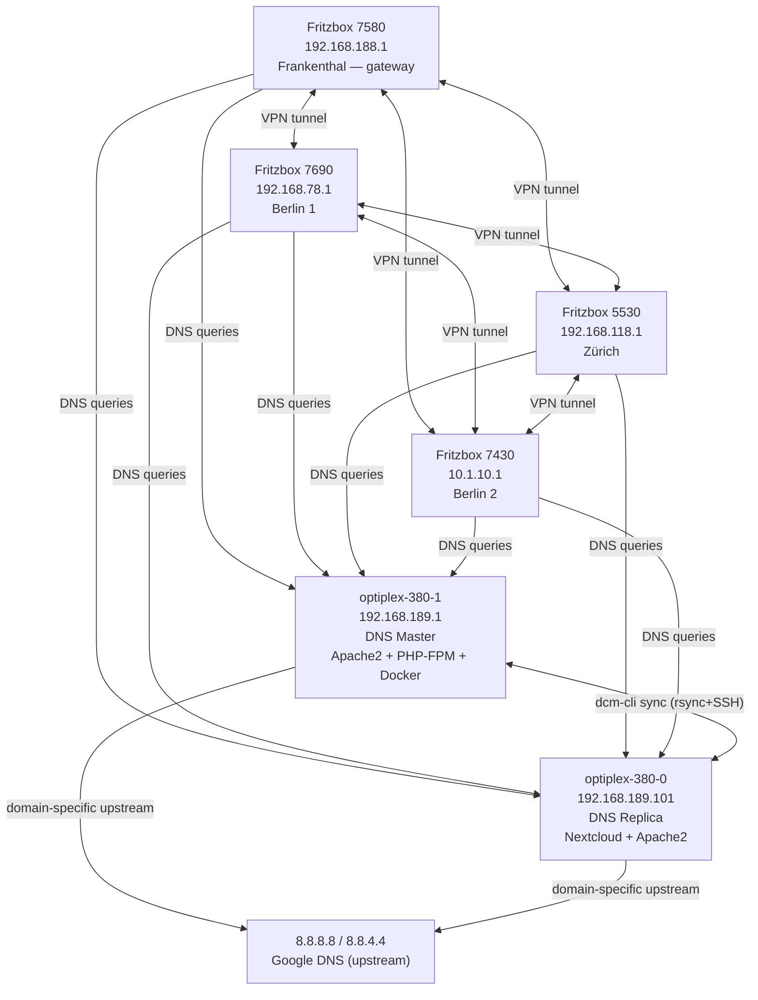
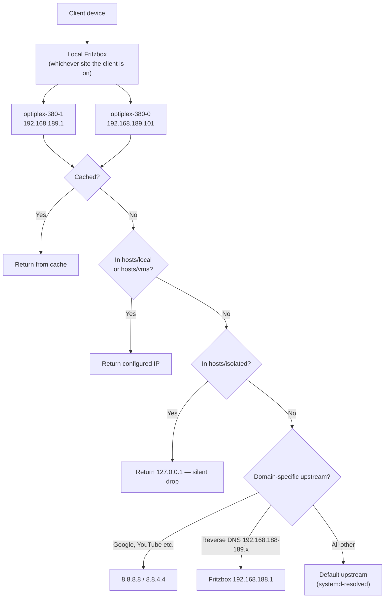
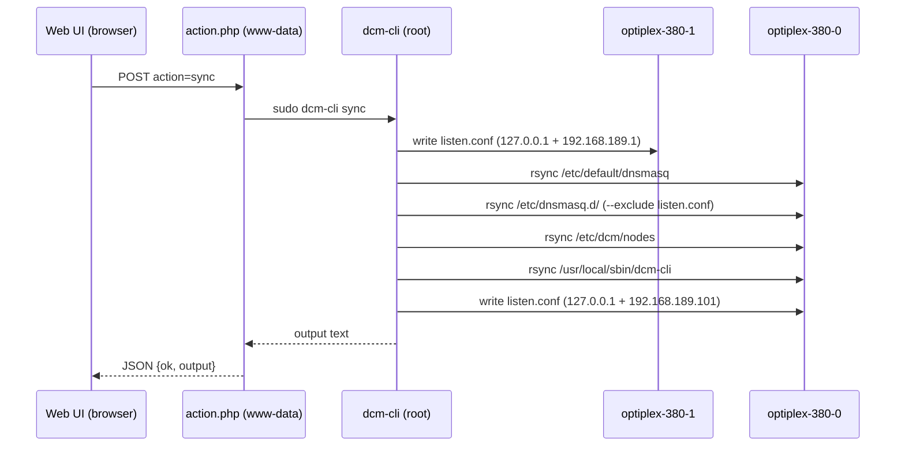
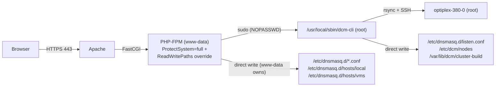
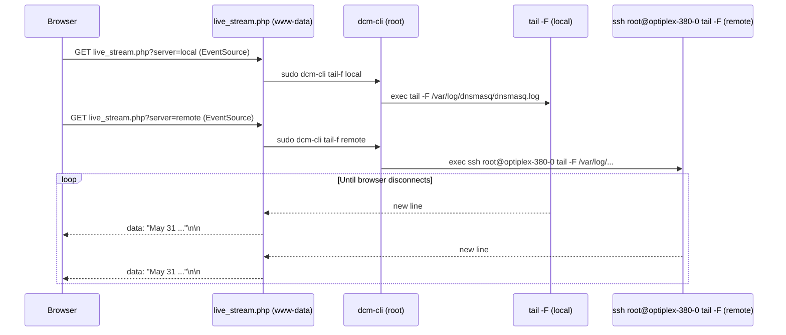
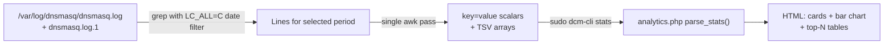

<!--
SPDX-FileCopyrightText: 2026 [ernolf] Raphael Gradenwitz
SPDX-License-Identifier: GPL-3.0-or-later
-->

# dnsmasq cluster manager: Architecture & Setup Reference

This document describes the complete architecture of the `dcm` - dnsmasq cluster management system as deployed in a multi-site home network. It serves as a reference for future development.

---

## 1. Network Overview

Four Fritzbox networks are interconnected via full-mesh VPN tunnels. All four share the same two dnsmasq servers as their primary DNS. Clients get their DNS server address via DHCP from their local Fritzbox, which forwards queries to the dnsmasq cluster.

| Site | Router | Network |
|---|---|---|
| Frankenthal | Fritzbox 7580 | 192.168.188.0/23 |
| Berlin 1 | Fritzbox 7690 | 192.168.78.0/24 |
| Zürich | Fritzbox 5530 Fiber | 192.168.118.0/24 |
| Berlin 2 | Fritzbox 7430 | 10.1.10.0/24 |


```mermaid
graph TD
    FB0["Fritzbox 7580\n192.168.188.1\nFrankenthal — gateway"]
    FB1["Fritzbox 7690\n192.168.78.1\nBerlin 1"]
    FB2["Fritzbox 5530\n192.168.118.1\nZürich"]
    FB3["Fritzbox 7430\n10.1.10.1\nBerlin 2"]

    DNS1["optiplex-380-1\n192.168.189.1\nDNS Master\nApache2 + PHP-FPM + Docker"]
    DNS2["optiplex-380-0\n192.168.189.101\nDNS Replica\nNextcloud + Apache2"]

    GG["8.8.8.8 / 8.8.4.4\nGoogle DNS (upstream)"]

    FB0 <-->|VPN tunnel| FB1
    FB0 <-->|VPN tunnel| FB2
    FB0 <-->|VPN tunnel| FB3
    FB1 <-->|VPN tunnel| FB2
    FB1 <-->|VPN tunnel| FB3
    FB2 <-->|VPN tunnel| FB3

    FB0 -->|DNS queries| DNS1
    FB0 -->|DNS queries| DNS2
    FB1 -->|DNS queries| DNS1
    FB1 -->|DNS queries| DNS2
    FB2 -->|DNS queries| DNS1
    FB2 -->|DNS queries| DNS2
    FB3 -->|DNS queries| DNS1
    FB3 -->|DNS queries| DNS2

    DNS1 <-->|"dcm-cli sync (rsync+SSH)"| DNS2
    DNS1 -->|"domain-specific upstream"| GG
    DNS2 -->|"domain-specific upstream"| GG
```

The dnsmasq servers live in the home network (`192.168.189.x`), which is a /23 subnet of the home Fritzbox. All four Fritzboxen forward DNS queries to both servers. Clients always query through their local Fritzbox.

---

## 2. dnsmasq Configuration

Both servers run **identical configuration** except for `listen.conf` (server-specific listen address).

### `/etc/default/dnsmasq`
```
ENABLED=1
DNSMASQ_OPTS="--conf-file=/dev/null"
CONFIG_DIR=/etc/dnsmasq.d,.dpkg-dist,.dpkg-old,.dpkg-new
IGNORE_RESOLVCONF=yes
```

### Drop-in configuration

There is no monolithic config file — `--conf-file=/dev/null` makes dnsmasq read **only** the drop-ins in `/etc/dnsmasq.d/`. Each setting is its own `<directive>.conf` (present = active, absent = dnsmasq's default), written by the Configuration page. Key drop-ins:
- `domain-needed.conf` / `bogus-priv.conf` — security
- `resolv-file.conf` — upstream from systemd-resolved (`resolv-file = /run/systemd/resolve/resolv.conf`)
- `addn-hosts.conf` (`addn-hosts = /etc/dnsmasq.d/hosts`) — loads the entire hosts directory
- `log-queries.conf` + `log-facility.conf` — full query logging

### `/etc/dnsmasq.d/` structure

| File | Synced | Purpose |
|---|---|---|
| `<directive>.conf` | Yes | one drop-in per dnsmasq option (Configuration page) |
| `listen.conf` | **No** | `listen-address = 127.0.0.1` + own IP — generated per node |
| `upstream.conf` | Yes | All `server =` directives |
| `address.conf` | Yes | All `address =` directives (Fixed Addresses page) |
| `hosts/local` | Yes | LAN hosts, swarm nodes, Fritzboxen |
| `hosts/vms` | Yes | VM entries — IPs change per connected network |
| `hosts/isolated` | Yes | Phone-home domains → 127.0.0.1 (Acronis, Adobe, Piriform) |

### DNS query routing logic


```mermaid
flowchart TD
    Client["Client device"] --> FB["Local Fritzbox\n(whichever site the client is on)"]
    FB --> DNS1["optiplex-380-1\n192.168.189.1"]
    FB --> DNS2["optiplex-380-0\n192.168.189.101"]
    DNS1 --> Cache{"Cached?"}
    DNS2 --> Cache
    Cache -->|Yes| CacheReply["Return from cache"]
    Cache -->|No| Hosts{"In hosts/local\nor hosts/vms?"}
    Hosts -->|Yes| LocalReply["Return configured IP"]
    Hosts -->|No| Isolated{"In hosts/isolated?"}
    Isolated -->|Yes| Quarantined["Return 127.0.0.1 — silent drop"]
    Isolated -->|No| Domain{"Domain-specific upstream?"}
    Domain -->|"Google, YouTube etc."| Google["8.8.8.8 / 8.8.4.4"]
    Domain -->|"Reverse DNS 192.168.188-189.x"| Fritz["Fritzbox 192.168.188.1"]
    Domain -->|"All other"| Default["Default upstream\n(systemd-resolved)"]
```

---

## 3. The `dcm-cli` Tool

Location: `/usr/local/sbin/dcm-cli` — present on **both** nodes, synced automatically.

PHP calls it via `sudo` (sudoers: `www-data ALL=(root) NOPASSWD: /usr/local/sbin/dcm-cli *`).

### Key design decisions

- **Single source of truth for listen IP**: reads node IPs from `hosts/local`, never hardcodes them
- **Single source of truth for paths**: reads `CONFIG_DIR` from `/etc/default/dnsmasq`, then `addn-hosts` / `log-facility` from the merged drop-ins
- **Single source of truth for swarm members**: `/etc/dcm/nodes` (hostname list only)
- **`listen.conf` is never synced**: regenerated from `hosts/local` after every sync
- **Content-based drift detection**: `health` and `diff` dry-run `rsync --checksum`, so a node counts as out of sync only when file *content* differs — a mere mtime change is ignored — and `listen.conf` is excluded (it is intentionally per-node)
- **`LC_ALL=C` for all `date` calls**: dnsmasq logs in English (`May 31`), system locale is German (`Mai 31`)
- **No dnsmasq version is hardcoded**: every node reports its own build (see below), and the UI offers what the weakest node understands

### Commands

```
sync                           Sync all config files + dcm-cli binary to all remote nodes
restart local|remote|all       systemctl restart dnsmasq
status  local|remote           systemctl status dnsmasq
logs    [N]                    tail -n N of log file
tail-f  local|remote           tail -F — streaming, used by SSE live log endpoint
stats   local|remote [period]  single-pass awk analytics (all|today|1h|24h|7d)
health                         Live sync/restart/build state as key=value, polled by the UI bell
diff                           Human-readable list of what a sync would change per remote node
node-report                    This node's restart state and dnsmasq build; used by health
```

### Sync flow


```mermaid
sequenceDiagram
    participant UI as Web UI (browser)
    participant PHP as action.php (www-data)
    participant CLI as dcm-cli (root)
    participant L as optiplex-380-1
    participant R as optiplex-380-0

    UI->>PHP: POST action=sync
    PHP->>CLI: sudo dcm-cli sync
    CLI->>L: write listen.conf (127.0.0.1 + 192.168.189.1)
    CLI->>R: rsync /etc/default/dnsmasq
    CLI->>R: rsync /etc/dnsmasq.d/ (--exclude listen.conf)
    CLI->>R: rsync /etc/dcm/nodes
    CLI->>R: rsync /usr/local/sbin/dcm-cli
    CLI->>R: write listen.conf (127.0.0.1 + 192.168.189.101)
    CLI-->>PHP: output text
    PHP-->>UI: JSON {ok, output}
```

### Cluster build detection

dcm replicates one identical configuration to every node, so the cluster has to agree on what that configuration may contain. **Running the same dnsmasq version on all nodes is a hard requirement**, for two reasons:

- dnsmasq aborts at startup on an option it does not know. A directive only the newer build understands takes the older node down on its next restart — after a sync, not at the moment the setting is saved.
- Semantics change between releases. Since 2.86, `address=/dom/<ip>` no longer suppresses other query types on its own; the same line therefore answers differently on 2.85 and on 2.91.

Nothing is hardcoded about a particular release. Each node reports its own build to `health`, which asks `node-report` locally and over SSH:

| Source | What it yields |
|---|---|
| `LC_ALL=C dnsmasq --version` | version, plus the compile time options (`ipset`, `no-nftset`, `DNSSEC`, …) |
| `LC_ALL=C dnsmasq --help` | every long option this build accepts |

`LC_ALL=C` is mandatory — the system locale is German and dnsmasq translates both outputs. `--help` is not filtered by the compile time options (a `no-nftset` build still lists `--nftset`), so the two lists answer different questions and both are kept.

`health` also checks the configured drop-ins against each node's option list and reports every directive a node would choke on (`build-unknown`), which is the case that actually takes a node down: the config is written on the UI node, and the older node only fails when it restarts with it. It writes one TSV record per node (`node`, `version`, `features`, `options`) to `/var/lib/dcm/cluster-build`. Records of nodes that were unreachable are carried over, so a node being down cannot silently widen what the UI offers. The web side reads that cache — no SSH per page view — and `inc/dnsmasq_build.php` reduces it to the **cluster floor**: the oldest version, and only those features and options that *every* node has. A directive outside that floor is rendered read-only with the reason, and `dropin_editable()` is the single gate for rendering, saving and writing, so a blocked directive is neither written nor silently deleted.

The same idea applies to the directive help texts: `inc/manpage.php` parses the dnsmasq(8) manual page installed next to the running binary, so the help describes the behaviour this node actually has. `inc/dnsmasq_manpage.php` is a generated copy of that text (`tools/gen-manpage.php`) and is used only where manual pages are stripped.

---

## 4. Web Frontend

URL: `https://dns.global-social.net/` (Apache2 on optiplex-380-1, port 443, wildcard TLS cert)
Also: `https://adblock.global-social.net/` (ad-server sink — served by same Apache, returns blocked page)

### Page map

The sidebar order matches this table.

| Page | File | Description |
|---|---|---|
| Dashboard | `dashboard.php` | Server status (incl. listen addresses, port and running dnsmasq version), **What differs?** / Sync / Restart controls with live output |
| Configuration | `dnsconf.php` | Per-directive drop-in editor — schema-driven switches/selects with dnsmasq manual help |
| Hosts | `hosts.php` | Edit `hosts/local` — add/remove/enable/disable entries |
| Virtual Machines | `vms.php` | Edit `hosts/vms` + one-click subnet relocation |
| Isolated Hosts | `isolated.php` | View `hosts/isolated` grouped by redirect IP |
| Upstream DNS | `upstream.php` | Per-directive editor for the upstream group (no-resolv, resolv-file, server, …); servers go to `upstream.conf` |
| Fixed Addresses | `address.php` | Edit `address.conf` — domains answered from one fixed address instead of being forwarded |
| Live Log | `live.php` | Real-time SSE log viewer, two panels (local + remote), color-coded, layout toggle, dark mode |
| Analytics | `analytics.php` | Full log analysis — time range + server filter, persisted via cookie |

### Notifications

A bell in the top bar of every page is fed by polling `action.php?action=health` → `dcm-cli health` (on load, every 60 s, and immediately after a Sync/Restart on the Dashboard). It is greyed out when all is well and glows gold when there is something to do, derived purely from live state — no database:

- **Sync pending** — a node's configuration differs (content-compared via `rsync --checksum`).
- **Restart pending** — a drop-in or hosts file is newer than the running dnsmasq on some node (`node-report`). The editing pages write a file only when its content really changes, so re-saving an entry unchanged raises no alarm.
- **Version mismatch** — the nodes run different dnsmasq versions. The message names each node's version and the one to upgrade to; the Dashboard shows the same warning above the server cards.
- **Feature mismatch** — the versions match but the builds were compiled with different options, so the same configuration does not behave the same everywhere.
- **Unknown directive** — a directive in the current configuration is not in some node's option list. That node's dnsmasq would exit at startup, so it is named together with the directive.

Clicking a notification jumps to the Dashboard, where **What differs?** (`dcm-cli diff`) lists the exact paths. Transient confirmations such as *Saved.* appear as a top-right toast and are not persisted (the editable pages redirect to `?saved=1`, the toast fires once, then the query is stripped so a refresh does not repeat it). A persisted fault/notification history (unreachable node, lost upstream, with timestamps) backed by SQLite is a planned phase-2 feature.

### Security architecture


```mermaid
graph LR
    Browser -->|HTTPS 443| Apache
    Apache -->|FastCGI| PHPFPM["PHP-FPM (www-data)\nProtectSystem=full +\nReadWritePaths override"]
    PHPFPM -->|"sudo (NOPASSWD)"| CLI["/usr/local/sbin/dcm-cli (root)"]
    CLI -->|"rsync + SSH"| Remote["optiplex-380-0 (root)"]
    CLI -->|"direct write"| EtcDnsmasq["/etc/dnsmasq.d/listen.conf\n/etc/dcm/nodes\n/var/lib/dcm/cluster-build"]
    PHPFPM -->|"direct write (www-data owns)"| HostsFiles["/etc/dnsmasq.d/*.conf\n/etc/dnsmasq.d/hosts/local\n/etc/dnsmasq.d/hosts/vms"]
```

PHP-FPM runs with `ProtectSystem=full` (systemd sandboxing makes `/etc` read-only). Override in `/etc/systemd/system/php8.4-fpm.service.d/override.conf`:
```ini
[Service]
ReadWritePaths=/etc/dnsmasq.d /etc/dcm
```
This applies to all child processes including `sudo dcm-cli`. The Configuration page additionally needs `/etc/dnsmasq.d` group-writable by `www-data` (`chown root:www-data` + `chmod 2775`) so it can create and remove `<directive>.conf` drop-ins.

---

## 5. Live Log (SSE Architecture)


```mermaid
sequenceDiagram
    participant B as Browser
    participant LS as live_stream.php (www-data)
    participant CLI as dcm-cli (root)
    participant TailL as tail -F (local)
    participant TailR as ssh root@optiplex-380-0 tail -F (remote)

    B->>LS: GET live_stream.php?server=local (EventSource)
    LS->>CLI: sudo dcm-cli tail-f local
    CLI->>TailL: exec tail -F /var/log/dnsmasq/dnsmasq.log

    B->>LS: GET live_stream.php?server=remote (EventSource)
    LS->>CLI: sudo dcm-cli tail-f remote
    CLI->>TailR: exec ssh root@optiplex-380-0 tail -F /var/log/...

    loop Until browser disconnects
        TailL-->>LS: new line
        LS-->>B: data: "May 31 ..."\n\n
        TailR-->>LS: new line
        LS-->>B: data: "May 31 ..."\n\n
    end
```

The browser opens two separate `EventSource` connections (one per server). Lines are color-coded:
- Blue: `query[A]` · Purple: `query[AAAA]` · Teal: `query[HTTPS]` · Light blue: other query types
- Yellow: `forwarded` · Green: `cached`
- Red: `NXDOMAIN` · Orange: `NODATA` · Dark red: `SERVFAIL/REFUSED`
- Grey: `config` / hosts file responses

Layout toggles between side-by-side and stacked. Sidebar collapsible for full-width view.

---

## 6. Analytics Pipeline


```mermaid
flowchart LR
    LogFile["/var/log/dnsmasq/dnsmasq.log\n+ dnsmasq.log.1"] -->|"grep with LC_ALL=C date filter"| Filtered["Lines for selected period"]
    Filtered -->|"single awk pass"| Stats["key=value scalars\n+ TSV arrays"]
    Stats -->|"sudo dcm-cli stats"| PHP["analytics.php parse_stats()"]
    PHP --> UI["HTML: cards + bar chart\n+ top-N tables"]
```

Single awk pass collects: query types (A/AAAA/HTTPS/PTR/…), cache hits, forwarded, locally resolved, blocked, NXDOMAIN/NODATA/SERVFAIL/REFUSED/CNAME, per-hour counts, top 15 upstreams, top 20 domains, top 15 clients.

Filter periods: `1h` · `today` · `24h` · `7d` · `all` — filter selection persisted via 30-day cookie.

---

## 7. VM Subnet Relocation

VMs in `hosts/vms` keep a fixed last octet across all networks. When the laptop connects to a different network, one click in `vms.php` replaces all IP prefixes while preserving last octets.

```
192.168.78.40  freetz        →   10.1.10.40  freetz
192.168.78.50  freetz-linux  →   10.1.10.50  freetz-linux
192.168.78.84  vm-ubuntu     →   10.1.10.84  vm-ubuntu
192.168.78.85  vm-2404       →   10.1.10.85  vm-2404
```

---

## 8. Open TODOs

- **Auth**: `inc/auth.php` is a stub — always passes. Add HTTP Basic Auth or session login when external access is needed.
- **Compressed logs**: `.log.2.gz` and older not yet analyzed — add `zcat` support for longer time ranges.
- **Isolated hosts**: read-only in UI. Editing requires `hosts/isolated` to be owned by `www-data`.
- **Notification history (phase 2)**: the bell reflects live state only; persist faults/events (unreachable node, lost upstream, with timestamps) in SQLite, fed by a periodic background check.
- **Theming**: a Skin/Style page to pick light/dark palettes and custom accent colours, built on the existing CSS variables and stored in SQLite.
