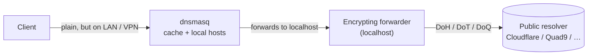
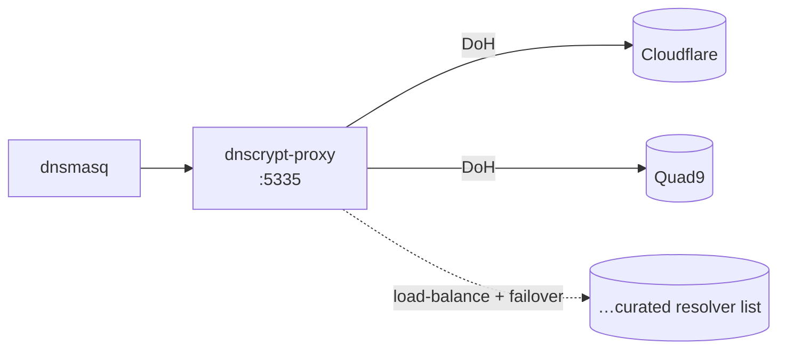
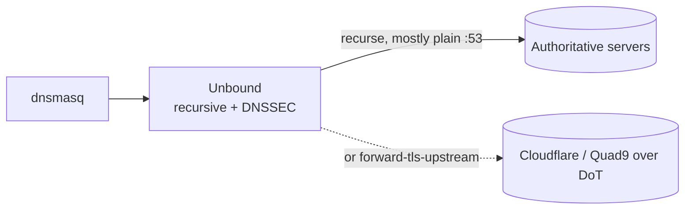
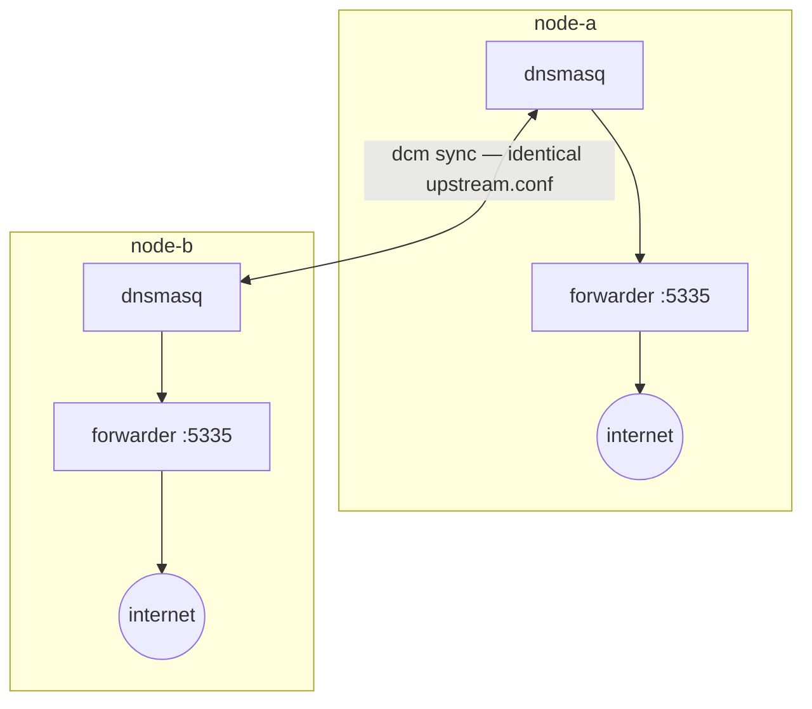

<!--
SPDX-FileCopyrightText: 2026 [ernolf] Raphael Gradenwitz
SPDX-License-Identifier: GPL-3.0-or-later
-->

# Encrypting upstream DNS (and adding DNSSEC)

`dnsmasq` is an excellent LAN resolver and forwarder, but it has two deliberate limitations: it forwards upstream queries in **plain text on port 53**, and it cannot speak DNS over HTTPS/TLS/QUIC. This note explores how to add **confidentiality** (encrypted upstream) and, optionally, **authenticity** (DNSSEC) to a dcm cluster, and compares the practical options.

> **Status: planning note.** None of this is integrated into dcm yet. It documents the design space so the project can build on it. Contributions and opinions welcome.

## Two different goals (often confused)

| Goal | What it gives you | Technology |
|---|---|---|
| **Confidentiality** | nobody on the path (ISP, Wi-Fi, transit) can read your queries | DoH / DoT / DoQ |
| **Authenticity** | answers are provably genuine and untampered | DNSSEC |

They are independent. DNSSEC does **not** encrypt; DoH/DoT/DoQ do **not** by themselves prove authenticity. You can use either, both, or neither.

## Where encryption belongs in a dcm cluster

Clients reach dnsmasq over the LAN (and, between sites, over VPN tunnels that are already encrypted). The only leg that crosses the open internet in clear text is **dnsmasq → upstream resolver**. That is the leg worth encrypting.

The pattern: keep dnsmasq as the LAN resolver (cache, local records, split routing) and put a small **encrypting forwarder** between it and the internet, listening on localhost. dnsmasq's default upstream becomes that forwarder.



Only the **P → R** leg leaves the machine, and it is encrypted. Cache hits in dnsmasq never go out at all.

## Option A — Forward to an encrypted public resolver

A lightweight proxy encrypts queries to a chosen third-party resolver. You still trust that resolver with your queries, but your ISP cannot see them and you can pick no-log providers.

Tools: **dnscrypt-proxy** (DNSCrypt + DoH + ODoH), **AdGuard dnsproxy** (DoH/DoT/DoQ), **cloudflared** (DoH, Cloudflare only).



Notes:
- The proxy only talks to resolvers that publish a DNSCrypt/DoH/DoQ endpoint — **not** an arbitrary plain-`:53` server. dnscrypt-proxy ships a large, signed resolver list (Cloudflare, Quad9, Google, AdGuard, NextDNS, plus many community resolvers) and load-balances / fails over across the ones you allow.
- Selection can be driven by policy: `require_dnssec`, `require_nolog`, `require_nofilter`.
- Optional: **Anonymized DNSCrypt** relays or **ODoH** also hide your IP from the resolver.

## Option B — Run a local recursive, validating resolver

Instead of trusting a third party, run a resolver that recurses from the root servers itself and validates DNSSEC. Optionally forward the upstream leg over DoT.

Tool: **Unbound**.



Notes:
- When recursing, **no single third party** sees all your queries; DNSSEC validation happens here, end to end.
- The recursion leg to the authoritative servers is mostly clear text (privacy by distribution, not by encryption) — unless you `forward-tls-upstream` to a DoT resolver, which re-introduces third-party trust but adds encryption.

## Capability comparison

| Tool | DoH | DoT | DoQ | Recurses itself | Validates DNSSEC | Weight |
|---|:---:|:---:|:---:|:---:|:---:|---|
| dnscrypt-proxy | ✅ | – | – | ❌ (forwards) | via resolver | light |
| AdGuard dnsproxy | ✅ | ✅ | ✅ | ❌ (forwards) | via resolver | light |
| cloudflared | ✅ | – | – | ❌ (forwards) | via Cloudflare | light |
| Unbound | limited | ✅ (upstream) | – | ✅ | ✅ (own) | light–medium |
| dnsdist (PowerDNS) | ✅ | ✅ | ✅ | ❌ | – | medium |
| CoreDNS | ✅ | ✅ | – | ✅ (plugin) | partial | medium |
| BIND 9.18+ | ✅ | ✅ | – | ✅ | ✅ | heavy |

> Capabilities are summarised and protocol support evolves between versions — verify against the version you install.

## DNSSEC: where to validate

- Let the **recursive / forwarding layer** validate: Unbound validates natively; public DoH resolvers such as Cloudflare and Quad9 validate for you.
- dnsmasq can validate too (`dnssec`, since 2.69), but only if the upstream passes the DNSSEC records (DO bit). Forwarding through systemd-resolved's stub or some ISP forwarders strips them, so dnsmasq-side validation is fragile unless the upstream is DNSSEC-transparent.
- Rule of thumb: validate in **one** place. With Unbound, let Unbound do it and leave dnsmasq's `dnssec` off. With a DoH proxy to a validating resolver, validation already happens upstream.

## Integrating with dcm

The upstream pointer lives in dnsmasq's `upstream.conf`, which dcm already syncs to every node. To route the default upstream through a local encrypting forwarder:

```sh
no-resolv
server=127.0.0.1#5335        # the local proxy / Unbound
# keep domain-specific routes, e.g. reverse DNS to a local gateway
```

`no-resolv` makes dnsmasq ignore `resolv-file`, so the encrypted path becomes authoritative.

Run **one forwarder per node**: each dnsmasq forwards to its own `127.0.0.1#5335`. Because dcm syncs `upstream.conf` identically and every node has its own local listener, the same line works everywhere — symmetric, with no single point of failure.



The forwarder service itself is not managed by dcm (yet); dcm manages only the `server=` pointer.

## Starting recommendation

- **Simplest privacy win, idiot-proof:** dnscrypt-proxy (or dnsproxy if you want DoQ), one per node, with two no-log resolvers (e.g. Quad9 + Cloudflare).
- **Privacy without trusting a single resolver, plus clean DNSSEC:** Unbound recursive, optionally forwarding over DoT.

Either way, dnsmasq keeps doing what it is best at — fast local resolution, caching and split-horizon routing — while the encrypted forwarder handles only what leaves the building.

## See also

- [`architecture.md`](architecture.md) — the overall dcm design.
- The setup README documents freeing port 53 from `systemd-resolved`, which is required before any of this.
